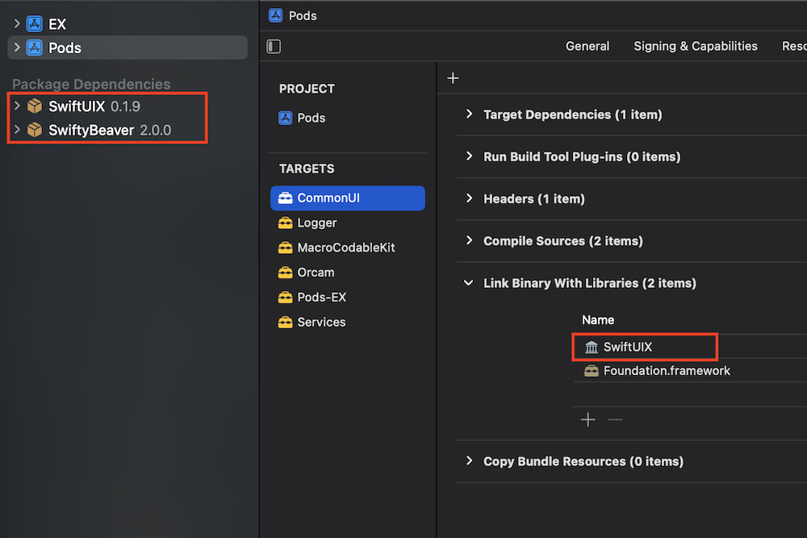

# Demo for cocoapods-spm Integration

## Highlights

- Declare SPM packages in Podfile: [Podfile#L10-L12](https://github.com/trinhngocthuyen/ios-demos/blob/main/cocoapods-spm/Podfile#L10-L12)
- Declare SPM dependencies in podspecs: [LocalPods/CommonUI/CommonUI.podspec#L4](https://github.com/trinhngocthuyen/ios-demos/blob/main/cocoapods-spm/LocalPods/CommonUI/CommonUI.podspec#L4)
- Declare prebuilt macro in Podfile [Podfile#L22-L25](https://github.com/trinhngocthuyen/ios-demos/blob/main/cocoapods-spm/Podfile#L22-L25).\
Then, other pods can depend on it just like normal: [LocalPods/CommonUI/CommonUI.podspec#L3](https://github.com/trinhngocthuyen/ios-demos/blob/main/cocoapods-spm/LocalPods/CommonUI/CommonUI.podspec#L3)

After running pod install, you should see:
- The SPM packages being added to the Pods project
- The SPM package products being linked to the pod target depending on it

