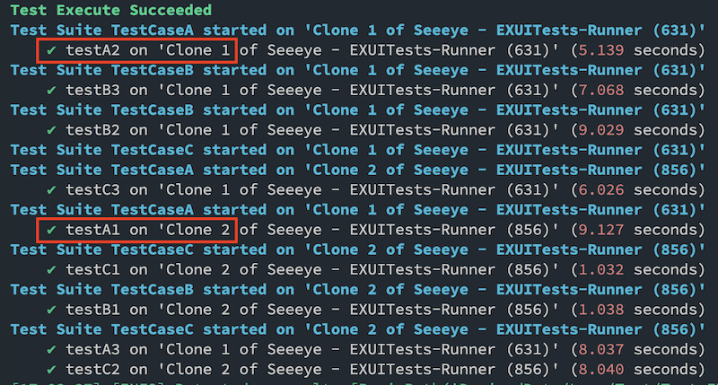

# Demo for Parallel Testing

Ref: https://engineering.grab.com/tackling-ui-test-execution-time-imbalance-for-xcode-parallel-testing

~~Disclaimer: The logic was broken in some recent Xcode/iOS releases.~~

-> Resolved!

-> Updated code: https://github.com/trinhngocthuyen/ios-demos/blob/main/parallel-testing/EXUITests/AutoloadSwizzlings.m#L8-L46


To run the demo
```sh
make demo
```



### Issues

~~`XCTestSuite.init(name:)` was not picked up by `XCTest` if we passed the unexpected test identifier in the `-only-testing` argument of the `xcodebuild` command.~~

-> Resolved!
